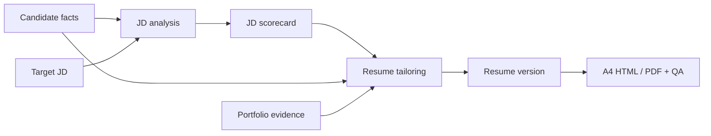

<p align="center">
  
</p>

<h1 align="center">Career OS</h1>

<p align="center">
  Evidence-first Codex skills for turning candidate facts, job signals, and portfolio proof into reviewable application materials.
</p>

<p align="center">
  <a href="./README.md">简体中文</a> ·
  <a href="#quick-start">Quick start</a> ·
  <a href="#privacy">Privacy</a> ·
  <a href="./CONTRIBUTING.md">Contributing</a>
</p>

> [!IMPORTANT]
> Career OS is currently a collection of Codex Agent Skills, not a hosted web application. The project is deliberately building reliable workflows and evidence boundaries before storage and UI layers.

## The problem

Career documents are difficult to maintain because facts drift between tailored versions, job descriptions mix real requirements with vague signals, portfolio evidence lives elsewhere, and a visually finished PDF can still contain placeholders or private information.

Career OS follows one rule: **confirm facts and evidence before optimizing the narrative, and keep intermediate outputs reviewable before producing final artifacts.**

## Included skills

| Skill | Purpose | Typical output |
| --- | --- | --- |
| [`jd-analysis`](./skills/jd-analysis/) | Separate explicit requirements, inferred signals, keywords, and gaps | JD scorecard and evidence brief |
| [`resume-tailor`](./skills/resume-tailor/) | Tailor summaries and bullets without inventing facts or metrics | Role-specific resume version |
| [`html-resume-builder`](./skills/html-resume-builder/) | Render confirmed content as a one-page A4 HTML/PDF and run delivery QA | Editable HTML, PDF, QA report |
| [`portfolio-curator`](./skills/portfolio-curator/) | Organize projects, writing, talks, communities, and public proof | Portfolio information architecture |

The skills can be used independently or as one pipeline:



## Quick start

```bash
git clone https://github.com/chenzhiyong1994/career-os.git
cd career-os
mkdir -p "$HOME/.agents/skills"
cp -R skills/* "$HOME/.agents/skills/"
```

On Windows PowerShell:

```powershell
New-Item -ItemType Directory -Force "$HOME\.agents\skills" | Out-Null
Copy-Item -Recurse -Force ".\skills\*" "$HOME\.agents\skills\"
```

You can also ask `$skill-installer` in Codex to install the skills from this repository. Codex usually detects skill changes automatically; restart it if the skills do not appear. See the [official OpenAI documentation](https://learn.chatgpt.com/docs/build-skills) for current skill structure and discovery behavior.

Example prompts:

```text
$jd-analysis Analyze this job description and separate hard requirements, inferred signals, keywords, and missing evidence.

$resume-tailor Tailor my confirmed experience to this scorecard. Do not invent metrics, tools, employers, or ownership.

$html-resume-builder Turn this confirmed resume into a one-page A4 HTML/PDF and run strict QA.

$portfolio-curator Organize my projects, writing, talks, and public links into a navigable portfolio.
```

The [`examples/`](./examples/) folder contains synthetic, public-safe material for exploring the workflow.

## Principles

- Evidence before eloquence.
- Explicit uncertainty and missing proof.
- Clear boundaries between analysis, writing, rendering, and portfolio curation.
- Deterministic checks for final HTML/PDF artifacts.
- Private career data stays out of public examples by default.

## Privacy

Do not commit real resumes, headshots, contact details, QR codes, recruiter messages, private job links, internal company screenshots, confidential metrics, API keys, or raw exports. Review filenames, PDF metadata, image EXIF, staged diffs, and Git history as well as visible text.

See [`docs/privacy-and-redaction.md`](./docs/privacy-and-redaction.md) for the checklist and [`SECURITY.md`](./SECURITY.md) for private reporting instructions.

## Status and roadmap

Completed: four scoped skills, an A4 resume template, strict export/QA helpers, synthetic examples, and public-release privacy guidance.

Planned: validated schemas for the core data objects, deterministic extraction helpers, plugin packaging, and—only after the outputs are stable—storage, version history, and a product UI.

## License

Original repository content is available under the [MIT License](./LICENSE). Materials identified inside `skills/html-resume-builder/` remain under that directory's [CC BY-NC 4.0 license](./skills/html-resume-builder/LICENSE) and must not be assumed commercially usable under the root MIT license. See [`NOTICE.md`](./NOTICE.md).

Contributions, public-safe edge cases, and concrete feedback are welcome. Please read [`CONTRIBUTING.md`](./CONTRIBUTING.md) before submitting material.
