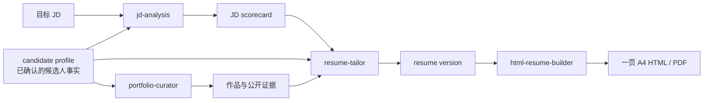

<p align="center">
  
</p>

<h1 align="center">Career OS</h1>

<p align="center">
  把散落的简历事实、JD 信号与作品证据，组织成可追溯、可复用、可交付的求职工作流。
</p>

<p align="center">
  <a href="./README.en.md">English</a> ·
  <a href="#快速开始">快速开始</a> ·
  <a href="#工作流">工作流</a> ·
  <a href="#隐私与脱敏">隐私与脱敏</a> ·
  <a href="./CONTRIBUTING.md">参与贡献</a>
</p>

<p align="center">
  <a href="https://github.com/chenzhiyong1994/career-os/stargazers"></a>
  
  
  
</p>

> [!IMPORTANT]
> Career OS 当前是一组可直接阅读、修改和安装的 Codex Agent Skills，不是已经上线的 Web 应用。仓库优先把核心工作流和事实边界做扎实，再逐步补齐结构化存储与产品界面。

## 为什么做 Career OS

求职材料真正难维护的，通常不是“再生成一份文本”，而是以下几件事同时发生：

- 同一段经历在不同岗位版本里反复改写，事实边界逐渐漂移；
- JD 关键词很多，但哪些是硬要求、哪些只是招聘话术并不清楚；
- 简历、作品集、项目证据和面试准备彼此割裂；
- 生成出的 PDF 看似完成，却可能有分页、裁切、占位符或隐私泄露问题。

Career OS 把这些工作拆成边界清晰的技能，并坚持一个简单原则：**先确认事实与证据，再决定如何表达；先形成可审查的中间对象，再生成最终材料。**

## 现在包含什么

| Skill | 适合处理 | 主要输出 |
| --- | --- | --- |
| [`jd-analysis`](./skills/jd-analysis/) | 拆解 JD、识别招聘信号、区分明确要求与推断 | `JD scorecard`、关键词、风险与待补证据 |
| [`resume-tailor`](./skills/resume-tailor/) | 基于真实证据调整摘要、经历 bullet 与 ATS 覆盖 | 岗位相关的 `resume version`、覆盖矩阵、待确认表述 |
| [`html-resume-builder`](./skills/html-resume-builder/) | 将已确认内容排成一页 A4 HTML/PDF，并执行视觉与交付 QA | 可编辑 HTML、PDF、QA 报告 |
| [`portfolio-curator`](./skills/portfolio-curator/) | 组织项目、文章、演讲、社群、公开链接等长期资产 | 作品集信息架构、`portfolio item`、证据缺口 |

这四个 Skill 不是四个互相竞争的“万能 Prompt”。它们分别负责分析、写作、交付和长期资产管理，可以单独使用，也可以串成一条完整链路。

## 工作流



每一步都保留自己的中间产物。这样既能单独审查，也能在换岗位时复用，不必从一份已经被改写多次的简历反推事实。

## 设计原则

- **证据优先**：姓名、公司、日期、指标、项目结果与职责范围都不能凭空补齐。
- **职责分层**：JD 分析不负责排版，渲染工具不擅自重写经历，作品集不必为每个岗位推倒重来。
- **显式不确定性**：推断、弱证据、待确认数字和高风险表述要被标记，而不是被流畅措辞掩盖。
- **交付可验证**：HTML/PDF 输出需要检查页数、尺寸、可提取文本、字体、占位符、图片和页面密度。
- **隐私默认收紧**：真实简历、头像、联系方式、二维码、公司内部材料和招聘沟通不进入公共示例。

## 快速开始

### 1. 获取仓库

```bash
git clone https://github.com/chenzhiyong1994/career-os.git
cd career-os
```

### 2. 安装 Skills

最省事的方式，是在 Codex 中请 `$skill-installer` 从这个仓库安装 `skills/` 下的 Skill。也可以手动复制到用户级 Skills 目录。

macOS / Linux：

```bash
mkdir -p "$HOME/.agents/skills"
cp -R skills/* "$HOME/.agents/skills/"
```

Windows PowerShell：

```powershell
New-Item -ItemType Directory -Force "$HOME\.agents\skills" | Out-Null
Copy-Item -Recurse -Force ".\skills\*" "$HOME\.agents\skills\"
```

Codex 通常会自动检测 Skill 变更；如果没有出现，重启 Codex。Skill 的目录结构与加载方式可参考 [OpenAI 官方文档](https://learn.chatgpt.com/docs/build-skills)。

### 3. 从一个具体任务开始

```text
$jd-analysis 分析这段 JD，区分硬性要求、推断信号、关键词和我需要补充的证据。

$resume-tailor 基于这份 JD scorecard 和我已确认的经历，重写简历摘要与经历 bullet；不要补造数字。

$html-resume-builder 把这版已确认的简历做成一页 A4 HTML/PDF，并完成严格 QA。

$portfolio-curator 把我的项目、文章、演讲和公开链接整理成可导航的个人作品集结构。
```

仓库中的 [`examples/`](./examples/) 提供了一组完全虚构、已脱敏的输入与输出骨架，可以先用它理解数据对象和协作方式。

## HTML 简历交付

`html-resume-builder` 包含一个可编辑的 A4 模板和两个确定性辅助脚本：

```bash
python skills/html-resume-builder/scripts/create_workspace.py \
  --output ./resume-workspace

python skills/html-resume-builder/scripts/export_and_qa.py \
  ./resume-workspace/resume.html \
  --pdf ./resume-workspace/resume.pdf \
  --strict-final
```

严格导出需要 Python、Chrome/Chromium/Edge，以及可用的 PDF 检查能力（例如 Poppler 或脚本支持的 Python PDF 库）。模板中的头像、二维码、姓名、联系方式和经历都是占位内容，正式导出前必须替换；严格 QA 会拒绝已知占位符和示例图片。

## 项目结构

```text
career-os/
├─ skills/
│  ├─ jd-analysis/
│  ├─ resume-tailor/
│  ├─ html-resume-builder/
│  └─ portfolio-curator/
├─ examples/                  # 纯虚构、可公开的演示材料
├─ docs/
│  ├─ assets/                 # README 视觉素材
│  └─ privacy-and-redaction.md
├─ AGENTS.md                  # 项目边界与 Skill 路由
├─ CONTRIBUTING.md
├─ SECURITY.md
└─ README.md
```

每个 Skill 的主流程位于 `SKILL.md`，可复用的长规范放在 `references/`，确定性脚本放在 `scripts/`，界面元数据放在 `agents/openai.yaml`。

## 隐私与脱敏

公开仓库不应该成为真实求职资料的备份盘。提交前至少检查：

- 姓名、手机号、邮箱、住址、证件信息、头像和可识别二维码；
- 公司、客户、学校或项目中的非公开名称、数据、截图与流程细节；
- 招聘人员联系方式、JD 私链、申请编号与带身份参数的 URL；
- PDF 元数据、图片 EXIF、导出文件名和 Git 历史中的旧版本；
- API key、Cookie、Token、私钥、账号配置与本地绝对路径。

仓库使用合成示例，并通过 `.gitignore` 隔离本地简历与生成物。更完整的公开检查清单见 [`docs/privacy-and-redaction.md`](./docs/privacy-and-redaction.md)。如果发现仓库中存在敏感信息，请不要在公开 Issue 中粘贴原文，按 [`SECURITY.md`](./SECURITY.md) 私下报告。

## 适合与不适合

适合：

- 希望把求职材料从一次性对话沉淀为可复用工作流的人；
- 在意事实准确性、证据链和面试可解释性的候选人；
- 想研究中文 JD 分析、简历优化、作品集整理或 Agent Skill 设计的人。

暂不适合：

- 期待开箱即用 SaaS、账号系统、岗位抓取或自动投递的人；
- 希望绕过事实确认，批量生成夸张经历或虚构指标的人；
- 需要法律、移民或雇佣合规结论的人。

## 路线图

- [x] 建立 JD 分析、简历优化、A4 交付与作品集整理的 Skill 边界
- [x] 提供 HTML/PDF 导出与严格 QA 脚本
- [x] 建立公开示例、脱敏规则和贡献入口
- [ ] 定义可验证的 `candidate profile`、`JD scorecard` 与 `application packet` Schema
- [ ] 增加确定性的 JD 关键词抽取与简历证据盘点辅助能力
- [ ] 打包为更易分发的 Codex Plugin
- [ ] 在核心输出稳定后探索存储、版本历史与完整应用界面

路线图只代表方向，不承诺时间。高质量的小改进、真实但已脱敏的使用反馈，以及能强化事实边界的测试，都很欢迎。

## 参与贡献

如果你也在解决中文求职材料中的证据、版本和交付问题，可以从以下方向参与：

- 补充不包含个人或公司机密的边界案例；
- 改进 Skill 的触发描述、输入输出契约和失败处理；
- 增强 HTML/PDF 的跨平台 QA；
- 提出数据 Schema、评测集或可解释匹配方法；
- 修正文档、无障碍体验与中英文表达。

开始前请阅读 [`CONTRIBUTING.md`](./CONTRIBUTING.md)。不确定是否适合公开的材料，默认不要提交原始内容，可以先提供脱敏后的最小复现。

## License

仓库自有内容默认采用 [MIT License](./LICENSE)。`skills/html-resume-builder/` 中标明的模板、资产与相关材料沿用其目录内的 [CC BY-NC 4.0](./skills/html-resume-builder/LICENSE)，不可据根目录 MIT License 推定为可商用。完整说明见 [`NOTICE.md`](./NOTICE.md)。

## 致谢

- HTML 简历模板与渲染基线源自 [KevinYoung-Kw/vibe-resume-skill](https://github.com/KevinYoung-Kw/vibe-resume-skill)，本仓库保留其署名与非商业许可要求。
- 项目在设计过程中参考了 [Resume Matcher](https://github.com/srbhr/Resume-Matcher)、[Reactive Resume](https://github.com/amruthpillai/reactive-resume)、[OpenResume](https://github.com/xitanggg/open-resume)、[JSON Resume](https://github.com/jsonresume/resume-schema) 等开源项目的公开思路；这些项目的代码未因此自动成为本仓库的一部分。

如果 Career OS 恰好解决了你维护求职材料时的一个真实麻烦，欢迎留下反馈、案例或改进建议。一个具体的使用问题，往往比泛泛的功能愿望更能帮助项目往前走。
